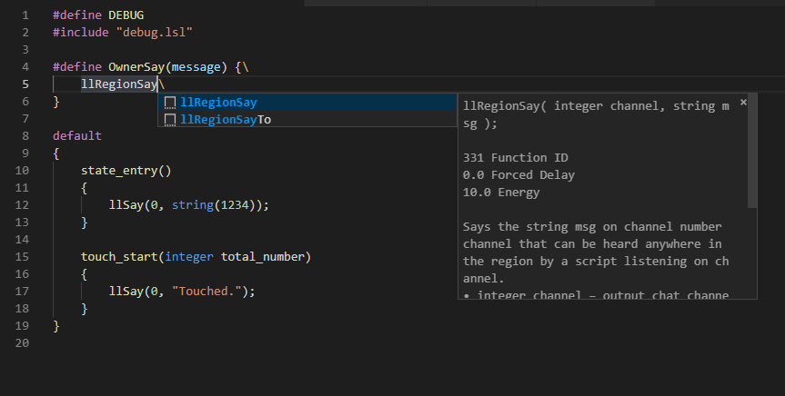

# LSL-FP

This extension adds syntaxes Highlighting and Code Snippeis for Firestorm LSL Preprocessor

## Features

Support for Firestorm LSL Preprocessor syntaxes Highlighting and Code Snippeis

Image Sample:

## Requirements

1. install LSL-FP in VSCode (Visual Studio Code)
2. Install Firestorm Viewer
3. Enable LSL Preprocessor in Firestorm Viewer
4. Enable '#includes from local disk' in Firestorm Viewer
5. Open 'External Script Editor' in Firestorm Viewer
6. Enjoy Scripting

## Known Issues

- Code Snippets for LSL All Constants Description.

## Release Notes

### 1.0.0 (2019-04-10)

- Initial release
- Added syntax Highlighting for LSL Flow Control.
- Added syntax Highlighting for LSL Types.
- Added syntax Highlighting for Firestorm LSL Preprocesser.
- Added Code Snippets for LSL Flow Control.
- Added Code Snippets for switch of Firestorm LSL Preprocesser.
- Added Code Snippets for LSL All Function.
- Added Code Snippets for LSL All Constants except Description.

-----------------------------------------------------------------------------------------------------------

### For more information

* [Firestorm Viewer](https://www.firestormviewer.org/)
* [Firestorm LSL Preprocessor Reference](https://wiki.phoenixviewer.com/fs_preprocessor)
* [LSL Potal](http://wiki.secondlife.com/wiki/LSL_Portal)
* [Github Repository](https://github.com/dalghost/vscode-lsl-fp)

**Enjoy Scripting!**
